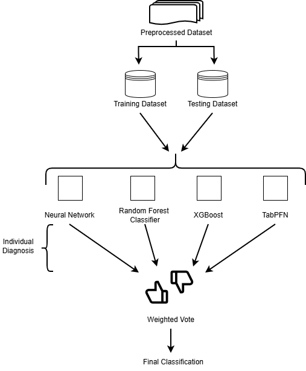

# Heart-Attack Prediction: Comparing 4 Models + an Ensemble

Predict heart-attack outcome (Result: 0/1) from routine clinical features (Age, Gender, Heart Rate, Systolic Blood Pressure, Diastolic Blood Pressure, Blood Sugar, CK-MB, Troponin).

## Models Compared
- Neural Network
- Random Forest Classifier
- XGBoost
- TabPFN
- Soft-Voting Ensemble Combining All Four

## Dataset
Kaggle: Heart Attack Dataset  
https://www.kaggle.com/datasets/fatemehmohammadinia/heart-attack-dataset-tarik-a-rashid

## Ensemble Architecture

`model_diagram.png`  

## Setup

#### Built in Python 3.10

### Option A - Conda

conda create -n condaEnv python=3.10 -y  
conda activate condaEnv  
pip install -r requirements.txt  

### Option B - Venv

python -m venv .venv

#### Windows
.\.venv\Scripts\Activate.ps1

#### macOS/Linux
source .venv/bin/activate

pip install -r requirements.txt